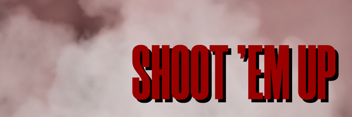
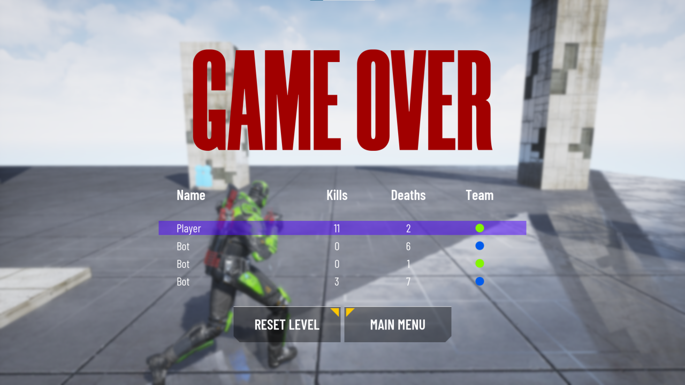

	

<h1 align="center">Shoot Them Up</h1>

<h2>Overview</h2>
Classic local third person shooter game with two weapons(rifle, launcher), AI bots, ammo and health pickups, and three different maps.

<h2>Prerequisites</h2>
Unreal Engine 4.27.2

<h2>Gameplay Demonstration</h2>
<h3>DeathMatch map</h2>

	

<h3>Labyrinth map</h2>

	

<h3>Sanctuary map</h2>

	

<h3>Statistics at the end of all rounds</h2>

	

<h2>Controls</h2>
<ul>
	<li>W - move forward
	<li>S - move backward
	<li>A - move left
	<li>D - move right
	<li>R - reload weapon
	<li>P - pause game
	<li>M - mute all sound effects
	<li>Spacebar - jump
	<li>Shift(while moving forward) - sprint
	<li>Mouse - aiming
	<li>Mouse left button - shoot
	<li>Mouse right button - zoom(only for rifle)
	<li>Spin mouse wheel - change weapon
</ul>

<h2>Known bugs</h2>
<ul>
	<li>Shooting while running
	<li>Launcher kills do not count in statistics
	<li>Weird AI bots change weapon behavior
</ul>

<h2>Try by yourself</h2>
You can download a zip file from <a href="https://psapronov.itch.io/shootthemup" target="_blank">itch.io</a> and play by yourself

<h2>License</h2>
Access to the sources of this project and their use are governed by the [Unreal Engine End User License Agreement](https://www.unrealengine.com/eula)